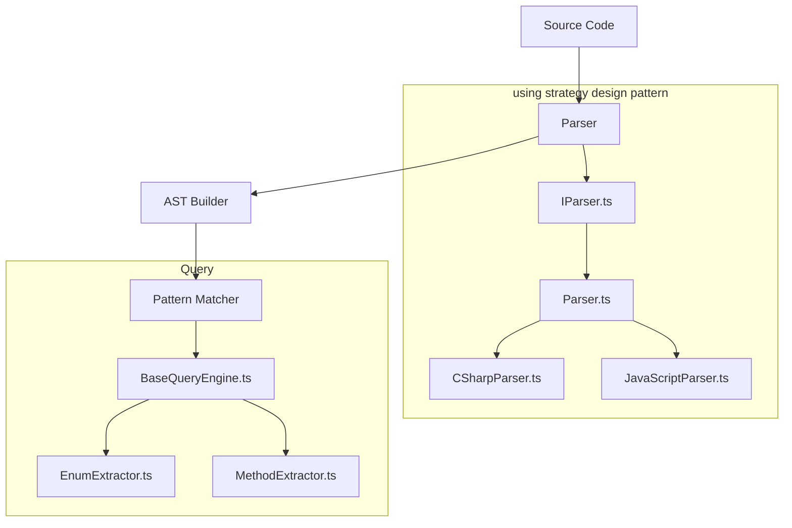

# Doci

## TODO

- [x] Script for downloading various programming language projects from github
- [ ] add electron.js for basic application

### Parser

- [ ] add test to test parser output with different programming language projects
- [ ] add query for querying class
- [ ] add parser method references
- [ ] add file import module for projects
- [ ] add parser logging

## Project Initial Setup and Development Run

1. Install dependencies:

```bash
   npm install
```

2. Clone repositories for testing:

```bash
   npm run test:setup
```

3. Run the live reload development environment:

```bash
   npm run dev
```

## Project Strategy: Parser Pattern Visualization



## Current Parser Output

```json
{
    "filePath": ".\\tests\\external-projects\\csharp\\BattleshipModellingPractice\\BattleshipModellingPractice\\Extensions\\EnumExtensions.cs",
    "methods": [
      {
        "name": "GetAttributeOfType",
        "parameters": [
          {
            "name": "this Enum enumVal"
          }
        ],
        "body": "{ ... }",
        "startPosition": {
          "row": 10,
          "column": 24
        },
        "endPosition": {
          "row": 10,
          "column": 42
        }
      }
    ],
    "enums": [],
},
```
