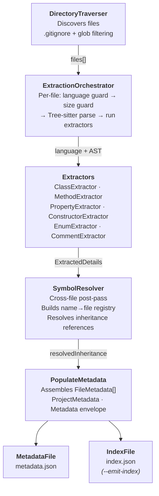
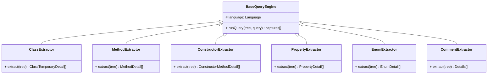

# CLI / Backend Scanner

[](https://github.com/Stebis-dev/Doci/actions/workflows/CICD_CLI_build.yml)

This tool's main objective is to parse a given repository and generate structured metadata about its codebase — classes, methods, properties, enums, inheritance relationships, and file statistics. It is designed to be used as a developer utility for auditing, documentation generation, dependency analysis, and building diagrams from source code.

---

## Table of Contents

- [Download](#download)
- [Installation & Development Setup](#installation--development-setup)
- [Usage](#usage)
  - [Commands Overview](#commands-overview)
  - [`scan` — Scan a directory](#scan--scan-a-directory)
  - [`show` — Display saved metadata](#show--display-saved-metadata)
  - [`extract` — Re-extract from saved metadata](#extract--re-extract-from-saved-metadata)
- [Output Files](#output-files)
- [Supported Languages](#supported-languages)
- [What Gets Extracted](#what-gets-extracted)
- [Architecture & Design](#architecture--design)
- [Libraries & Frameworks](#libraries--frameworks)
- [TODO](#todo)

---

## Download

Pre-built binaries are produced by the CI pipeline for every push to `main` that touches `apps/cli/`.  
Download the latest binary for your platform from the **Actions** tab:

> **[Latest CI artifacts →](https://github.com/Stebis-dev/Doci/actions/workflows/CICD_CLI_build.yml)**

Select the most recent successful run, then download the artifact for your platform:

| Artifact name             | Platform        | Binary             |
| ------------------------- | --------------- | ------------------ |
| `doci-cli-windows-latest` | Windows (x64)   | `doci-cli-win.exe` |
| `doci-cli-macos-latest`   | macOS (arm/x64) | `doci-cli-macos`   |
| `doci-cli-ubuntu-latest`  | Linux (x64)     | `doci-cli-linux`   |

> A versioned release pipeline (GitHub Releases with stable tags) is planned. Until then, CI artifacts are the canonical distribution channel.

---

## Installation & Development Setup

**Prerequisites:** Node.js ≥ 22, `pnpm`, and Bun (for building binaries).

```bash
# From the monorepo root
pnpm install

# Or from the CLI package directly
cd apps/cli
pnpm install
```

---

## Usage

### Running in development mode

```bash
# From apps/cli/
pnpm run dev -- scan -d /path/to/repo
```

### Running the compiled binary

```bash
# Windows
.\doci-cli-win.exe scan -d C:\path\to\repo

# macOS / Linux
./doci-cli-macos scan -d /path/to/repo
./doci-cli-linux scan -d /path/to/repo
```

### Global help

```bash
doci-cli-win.exe --help
doci-cli-win.exe --version
```

---

### Commands Overview

| Command   | Description                                                  |
| --------- | ------------------------------------------------------------ |
| `scan`    | Traverse a directory, extract metadata, and write output     |
| `show`    | Pretty-print a previously generated `metadata.json`          |
| `extract` | Re-run extraction passes against an existing `metadata.json` |

---

### `scan` — Scan a directory

The primary command. Traverses a directory tree, optionally performs semantic extraction, and writes a `metadata.json` artifact (and optionally an `index.json`).

```bash
doci-cli-win.exe scan [options]
```

| Option             | Default              | Description                                                          |
| ------------------ | -------------------- | -------------------------------------------------------------------- |
| `-d, --dir <path>` | Current directory    | Root directory to scan                                               |
| `--depth <level>`  | `file`               | Extraction depth: `file` \| `symbols` \| `full` (see below)          |
| `--include <glob>` | _(all files)_        | Only include files matching this glob. Comma-separated or repeatable |
| `--exclude <glob>` | _(none)_             | Skip files matching this glob. Comma-separated or repeatable         |
| `--output <path>`  | `temp/metadata.json` | Path to write the metadata JSON file                                 |
| `--stdout`         | off                  | Print JSON to stdout instead of writing a file                       |
| `--emit-index`     | off                  | Also write a flat `index.json` symbol lookup table beside the output |
| `-h, --help`       |                      | Display help                                                         |

#### Depth levels

| Level     | What is included                                                              |
| --------- | ----------------------------------------------------------------------------- |
| `file`    | File path, name, extension, MIME type, language, size, timestamps — no AST    |
| `symbols` | Everything from `file` + class/method/property/enum names and line positions  |
| `full`    | Everything from `symbols` + method bodies, docstrings, cross-file inheritance |

#### Examples

```bash
# Fast file inventory only
doci-cli-win.exe scan -d ./my-project

# Symbol map piped to another tool
doci-cli-win.exe scan -d ./src --depth symbols --stdout | jq '.files[].symbols'

# Full extraction, TypeScript only, write to a specific path
doci-cli-win.exe scan -d ./src --depth full --include "*.ts" --output ./out/meta.json

# Full extraction + LLM index
doci-cli-win.exe scan -d ./src --depth symbols --emit-index --output ./out/meta.json
```

#### Exit codes

| Code | Meaning                                               |
| ---- | ----------------------------------------------------- |
| `0`  | All files processed successfully                      |
| `1`  | Fatal error (invalid directory, unhandled exception)  |
| `2`  | Partial success — at least one file failed extraction |

---

### `show` — Display saved metadata

Reads an existing `metadata.json` and prints a summary to the log output.

```bash
doci-cli-win.exe show [options]
```

| Option             | Default | Description                                                  |
| ------------------ | ------- | ------------------------------------------------------------ |
| `-d, --dir <path>` | `.`     | Directory containing `metadata.json`                         |
| `--filter <what>`  | `all`   | What to display: `projects` \| `files` \| `summary` \| `all` |

---

### `extract` — Re-extract from saved metadata

Reads an existing `metadata.json` and re-runs the extraction passes. Useful for upgrading a previously generated artifact without re-traversing the directory.

```bash
doci-cli-win.exe extract [options]
```

| Option             | Default | Description                          |
| ------------------ | ------- | ------------------------------------ |
| `-d, --dir <path>` | `.`     | Directory containing `metadata.json` |

> **Note:** This command is currently in progress. Language-specific re-extraction is wired but the write-back step is not yet implemented.

---

## Output Files

All output is written relative to the `--output` path (default: `temp/metadata.json` from the executable directory).

### `metadata.json`

The primary artifact. Top-level shape:

```jsonc
{
  "instanceId": "<uuid>", // unique ID for this scan run
  "schemaVersion": "1.0",
  "generatedAt": "<ISO-8601>",
  "projects": [
    /* ProjectMetadata[] */
  ],
  "files": [
    /* FileMetadata[] */
  ],
  "totalProjects": 1,
  "counts": {
    "scanned": 42,
    "processed": 40,
    "skipped": 1,
    "failed": 1
  }
}
```

Each `FileMetadata` entry:

```jsonc
{
  "id": "<uuid>",
  "filePath": "/abs/path/to/file.ts",
  "fileName": "file.ts",
  "extension": "ts",
  "mimeType": "text/x.typescript",
  "language": "TypeScript",
  "sizeBytes": 1234,
  "createdAt": "<ISO-8601>",
  "modifiedAt": "<ISO-8601>",
  "status": "processed", // processed | skipped | failed
  "error": null,
  "symbols": {
    /* ExtractedDetails — present at depth=symbols or full */
  }
}
```

### `index.json` (`--emit-index`)

A flat, sorted array of every named symbol across all files — designed for LLM context injection or fast symbol search:

```jsonc
[
  {
    "symbolName": "Animal",
    "kind": "class", // class | method | constructor | property | enum
    "filePath": "/abs/path/Animal.ts",
    "startLine": 5,
    "endLine": 30,
    "docstring": "Base class for all animals."
  }
]
```

### Logs

All diagnostic output (progress, warnings, errors) is written to **stderr**, keeping **stdout** clean for `--stdout` mode:

```bash
doci-cli-win.exe scan -d ./src --stdout 2>scan.log | jq '.counts'
```

---

## Supported Languages

| Language       | Extensions            | Full symbol extraction            |
| -------------- | --------------------- | --------------------------------- |
| TypeScript     | `.ts`                 | ✅                                |
| TypeScript JSX | `.tsx`                | ✅                                |
| JavaScript     | `.js`, `.cjs`, `.mjs` | ✅                                |
| JavaScript JSX | `.jsx`                | ✅                                |
| All others     | any                   | File metadata only (`file` depth) |

All other file types are inventoried at `file` depth (path, size, MIME type, timestamps) but not parsed.

---

## What Gets Extracted

At `--depth symbols` or `--depth full`, the following constructs are extracted from TypeScript and JavaScript files:

| Symbol type     | What is captured                                                                         |
| --------------- | ---------------------------------------------------------------------------------------- |
| **Class**       | Name, modifiers (`abstract`), `extends`/`implements` list, start/end position, docstring |
| **Method**      | Name, parameters, start/end position, docstring, body (`full` only)                      |
| **Constructor** | Parameters, start/end position, body (`full` only)                                       |
| **Property**    | Name, modifiers, start/end position                                                      |
| **Enum**        | Name, members, start/end position                                                        |

### Cross-file inheritance resolution

After all files are extracted, a **post-processing pass** (`SymbolResolver`) resolves inheritance and interface references across files. Each class that `extends` or `implements` another type gets a `resolvedInheritance` array:

```jsonc
"resolvedInheritance": [
  { "name": "Animal", "filePath": "/abs/path/Animal.ts" },
  { "name": "Serializable", "filePath": null }   // null = external / not found in scan
]
```

---

## Architecture & Design

The tool is structured around a layered pipeline, each layer with a single responsibility:



### Extractor class hierarchy

Each extractor follows the **Template Method** pattern via `BaseQueryEngine` — the base class owns the Tree-sitter query runner; subclasses only supply the S-expression query and the result mapping:



### Key design patterns

| Pattern                                          | Where used                                           | Purpose                                                                                                                |
| ------------------------------------------------ | ---------------------------------------------------- | ---------------------------------------------------------------------------------------------------------------------- |
| **Template Method** (`BaseQueryEngine`)          | All extractors inherit from `BaseQueryEngine`        | Shares Tree-sitter query execution boilerplate; each extractor only provides the S-expression query and result mapping |
| **Strategy** (per-language WASM map)             | `parser.types.ts` `LanguageWasmMap`                  | Decouples language support from parser initialisation; adding a new language is a one-line registry entry              |
| **Singleton** (`ExtractionOrchestrator._parser`) | `ExtractionOrchestrator`                             | Shares and reuses the expensive Tree-sitter WASM initialisation across all files in a single scan run                  |
| **Registry** (`SymbolResolver` `SymbolRegistry`) | `SymbolResolver`                                     | Builds a `Map<name, filePath>` once, then resolves all inheritance references in a second pass without re-parsing      |
| **Command** (commander actions)                  | `commands/scan`, `commands/show`, `commands/extract` | Each CLI command is a self-contained module that registers itself on the Commander program instance                    |
| **Builder** (`PopulateMetadata`, `IndexBuilder`) | Metadata assembly and index creation                 | Separates construction of complex output objects from the pipeline that drives them                                    |

---

## Libraries & Frameworks

| Library                                                                  | Role                                                                      |
| ------------------------------------------------------------------------ | ------------------------------------------------------------------------- |
| [commander.js](https://www.npmjs.com/package/commander)                  | CLI framework — argument parsing, sub-commands, help generation           |
| [Bun](https://bun.sh/)                                                   | Binary compilation (`bun build --compile`) and WASM bundling for releases |
| [web-tree-sitter](https://www.npmjs.com/package/web-tree-sitter)         | WebAssembly build of Tree-sitter; language-agnostic AST parser            |
| [tsx](https://www.npmjs.com/package/tsx)                                 | TypeScript execution for development (`pnpm run dev`)                     |
| [vitest](https://vitest.dev/)                                            | Unit and integration test runner                                          |
| [vite-tsconfig-paths](https://www.npmjs.com/package/vite-tsconfig-paths) | Resolves `baseUrl` path aliases inside the vitest environment             |

| Language WASM Libraries                                                        | Role                                       |
| ------------------------------------------------------------------------------ | ------------------------------------------ |
| [tree-sitter-typescript](https://www.npmjs.com/package/tree-sitter-typescript) | Tree-sitter grammar for TypeScript and TSX |
| [tree-sitter-javascript](https://www.npmjs.com/package/tree-sitter-javascript) | Tree-sitter grammar for JavaScript and JSX |

---

## TODO

### Versioned release pipeline
- [ ] Add a GitHub Releases workflow triggered on `v*` tags
- [ ] Attach the three platform binaries as release assets with a changelog

### `show` command — structured JSON output
Currently `show` prints everything via `logger.info()`, which writes to stderr as human-readable log lines. There is no way to get the data as clean JSON on stdout.
- [ ] Add a `--json` flag so downstream tools can pipe `show` output the same way `scan --stdout` works

### `extract` command — write-back
The `extract` command reads an existing `metadata.json`, groups files by language, and initialises the parser — but the per-file re-extraction loop is commented out and there is no step to write updated symbols back to disk. The intent is to allow upgrading a previously generated `metadata.json` with richer symbol data (e.g. re-running at `--depth full`) without re-traversing the directory.
- [ ] Implement the per-language re-extraction loop
- [ ] Write the updated `FileMetadata[]` back via `MetadataFile.write()`

### Method-usage cross-reference extractor
`ExtractorType.MethodsUsed` and the `methodsUsed` field on `ClassDetail` are defined in the type system, and `method-usage.extractor.ts` exists in the extractors folder — but the extractor has no Tree-sitter query implemented yet. The goal is to track which external methods/functions each class or method *calls* (call-site references), enabling call-graph and dependency diagrams. This is harder than declaration extraction because call expressions can be chained, optional-chained, or aliased.
- [ ] Implement the Tree-sitter S-expression query for call expressions
- [ ] Wire `MethodUsageExtractor` into `extractDetails` alongside the existing extractors
- [ ] Add `SymbolResolver` support to resolve call targets cross-file

### Additional language grammars
- [ ] Python (`.py`) — `tree-sitter-python`
- [ ] C# (`.cs`) — `tree-sitter-c-sharp`
- [ ] Java (`.java`) — `tree-sitter-java`
- [ ] C / C++ (`.c`, `.cpp`, `.h`) — `tree-sitter-c`, `tree-sitter-cpp`
